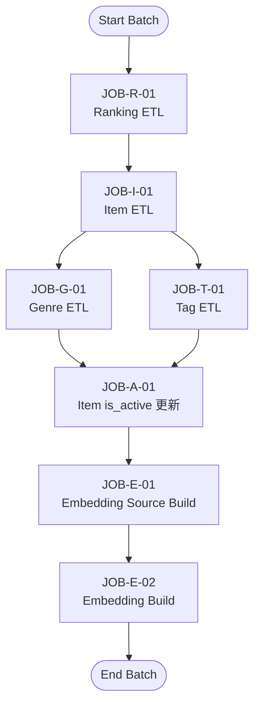

# バッチETL ジョブ一覧・ジョブネット仕様書

（GiftRecommend MVP）

## 1. 本ドキュメントの目的

本ドキュメントは、GiftRecommend MVP におけるバッチETL処理の全体像と実行順序を明確化し、以下を目的とする。

- 実装のブレ防止
- GitHub Actions 設計の基準
- 将来のジョブ追加・分割の土台

## 2. バッチジョブ一覧

### 2.1 ジョブ一覧（MVP）

| ジョブID | ジョブ名 | 種別 | 主対象 | 主な役割 |
| --- | --- | --- | --- | --- |
| JOB-R-01 | Ranking ETL | ETL | ranking | ・楽天ランキング取得 ・S3保存 ・staging反映 ・apl.item_rank_snapshot更新 |
| JOB-I-01 | Item ETL | ETL | item |・楽天商品取得 ・S3保存 ・staging反映 ・item更新 |
| JOB-G-01 | Genre ETL | ETL | genre |・楽天ジャンル取得 ・S3保存 ・staging反映 ・genre更新 |
| JOB-T-01 | Tag ETL | ETL | tag | ・楽天タグ取得 ・S3保存 ・staging反映 ・tag更新 |
| JOB-A-01 | Item is_active 更新 | 整合性 | item | ・genre/shop整合性に基づく商品有効化（apl.item.is_active更新） |
| JOB-E-01 | Embedding Source Build | ETL | embedding | ・apl.item_feature_viewからsource_text生成 ・apl.item_embedding_source更新 |
| JOB-E-02 | Embedding Build | ETL | embedding | ・OpenAI Embeddings生成 ・apl.item_embedding更新 |

### 2.2 各ジョブの責務概要

#### JOB-R-01 Ranking ETL

- 楽天ランキングAPIを呼び出す
- raw JSON を S3 に保存（hash差分）
- apl.staging (entity=ranking) を最新化
- apl.item_rank_snapshot をupsert（外部ID基準）
- バッチジョブネットフロー中では、 Ranking ETL で apl.item_rank_snapshot に upsertしたレコードの rakuten_item_code を後続の Item ETL の入力候補として抽出し、楽天商品データを収集する
- is_active はこのジョブでは確定しない

#### JOB-I-01 Item ETL

- 入力： Ranking ETL で当日（または最新run）に upsert された `apl.item_rank_snapshot` の `rakuten_item_code` を対象とする  
  ※ 入力集合は **item_rank_snapshot 起点に固定**（staging は差分判定用途のみ）
- 代替入力（例外）：item_rank_snapshot が未整備の場合のみ、CLI引数や固定リストで補う（運用で明示）
- 楽天 Item API を呼び出す
- raw JSON を S3 に保存（hash差分）
- apl.staging (entity=item) を最新化
- 下記テーブルに対して upsert（外部ID基準）
  - apl.item
  - apl.item_tag
  - apl.item_image
  - apl.item_market_snapshot
  - apl.item_review_snapshot
  - apl.shop
- バッチジョブネットフロー中では、 Item ETL で apl.item に upsert した rakuten_genre_id を後続の Genre ETL の入力候補として抽出し、楽天ジャンルデータを収集する
- バッチジョブネットフロー中では、 Item ETL で apl.item_tag に upsert した rakuten_tag_id を後続の Tag ETL の入力候補として抽出し、楽天タグデータを収集する
- is_active はこのジョブでは確定しない

#### JOB-G-01 Genre ETL

- 入力： apl.staging(entity=item) から当日更新分の itemCode を抽出し、apl.item と結合して `rakuten_genre_id` を取得  
  ※ 条件は `saved_at >= day_start`（当日0:00）
- 楽天 Genre API を呼び出す
- raw JSON を S3 に保存（hash差分）
- apl.staging (entity=genre) を最新化
- apl.genre を upsert

#### JOB-T-01 Tag ETL

- 入力： apl.staging(entity=item) から当日更新分の itemCode を抽出し、apl.item / apl.item_tag と結合して `rakuten_tag_id` を取得  
  ※ 条件は `saved_at >= day_start`（当日0:00）
- 楽天 Tag API を呼び出す
- raw JSON を S3 に保存（hash差分）
- apl.staging (entity=tag) を最新化
- apl.tag_group / apl.tag を upsert

#### JOB-A-01 Item is_active 更新

- apl.item を対象に整合性チェック
- 条件（MVP）
  - genre が存在
  - shop が存在
- 条件を満たす apl.item を is_active = true に update
- ETL系ジョブの最終工程

#### JOB-E-01 Embedding Source Build

- 入力：apl.item_feature_view（is_active=true かつ feature_updated_atが当日0:00以降）
- source_text / source_hash を生成
- apl.item_embedding_source を差分更新（source_hash変更時のみ）

#### JOB-E-02 Embedding Build

- 入力：apl.item_embedding_source と apl.item_embedding の差分
- OpenAI Embeddings API で embedding を生成
- apl.item_embedding を差分更新（source_hash変更時のみ）

## 3. ジョブネット図（Mermaid）

### 3.1 全体ジョブネット（MVP）

### 3.2 ジョブネット設計意図

**Ranking → Item**

- ranking は item_code の供給源
- item ETL は ranking 完了後に実行する

**Item → Genre / Tag**

- item ETL により参照される外部IDが確定
- genre / tag は item 後に実行

**is_active 更新は最後**

- genre / tag / shop が揃った状態で判定
- 中途半端な状態で true にしないため

**Embedding は is_active 後**

- is_active確定後に、Embedding入力の最終状態を作る

## 4. 並列実行の考え方（MVP）

- JOB-G-01 と JOB-T-01 は並列実行可能
- JOB-A-01 → JOB-E-01 → JOB-E-02 の順序は固定

※ GitHub Actions 上では以下のいずれも可能。

- step 並列
- workflow 分割＋依存指定

## 5. 本仕様の前提方針（再確認）

- raw データは S3にイミュータブル保存
- staging は最新台帳
- DBの整合性は ETLで担保（FKなし）
- is_active は整合性ジョブでのみ更新
