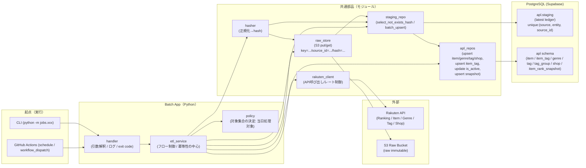
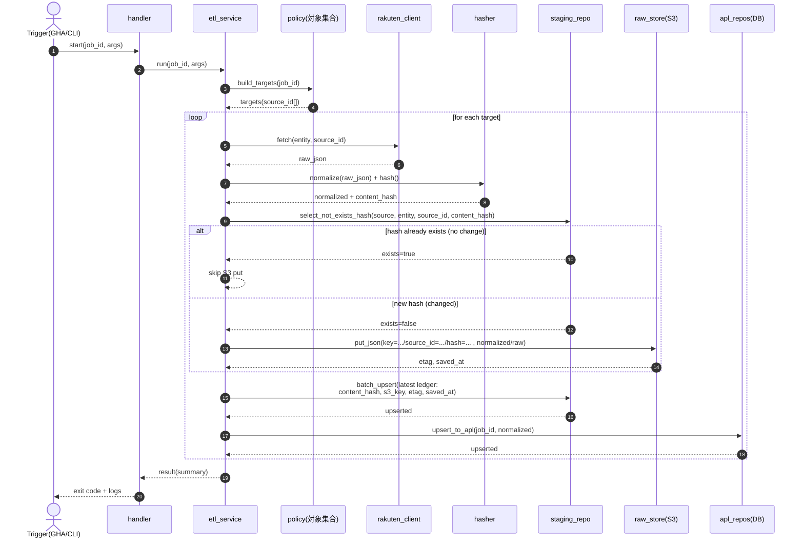
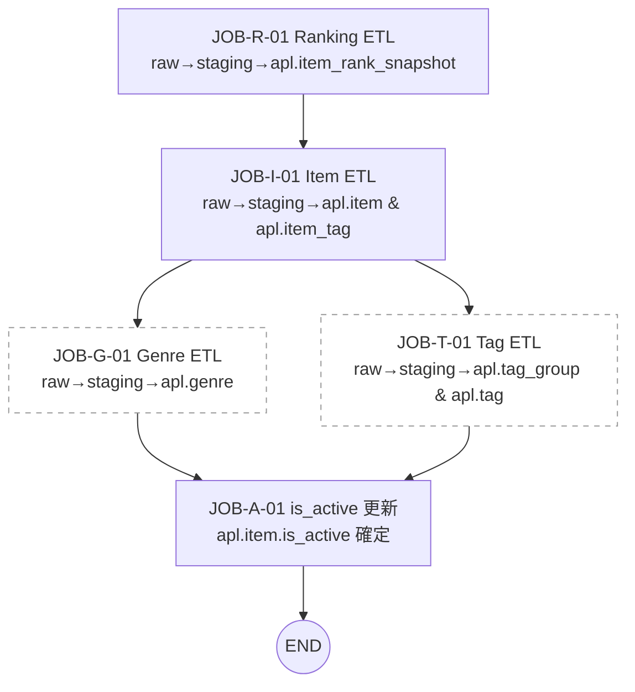
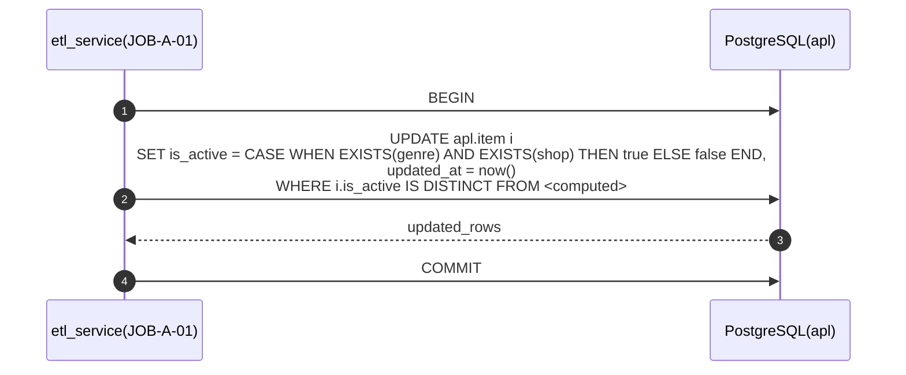

# 共通アーキテクチャ図＋データフロー図

## 共通アーキテクチャ図

## データフロー図

### 2.1 共通ETLフロー（raw差分→staging→apl）

「楽天APIレスポンス → 正規化 → hash → staging参照 → 未保存のみS3保存 → staging更新 → apl反映」
の共通骨格です（JOB-R/I/G/T で共通）。

### 2.2 ジョブネット（確定フロー）

ジョブネットを、実行順の依存として表現する。

### 2.3 is_active 更新フロー（最後に必ず実行）

「genre と shop が存在する」→ true、そうでない→ false。
IS DISTINCT FROM で無駄更新を抑制し、updated_at = now() を明示。

